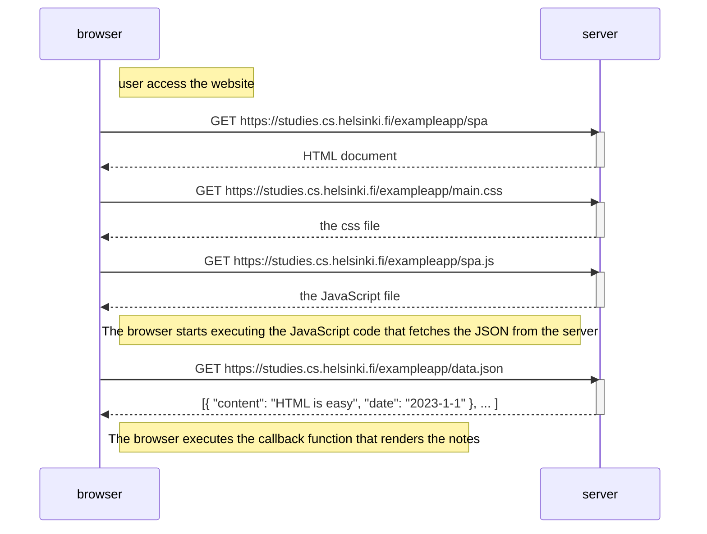
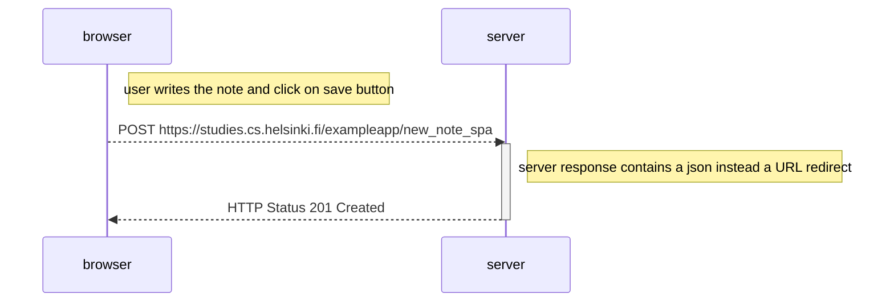

# FullStackOpen

## Exercise 0.5 - Answer

## 1. Acessing the SPA

```mermaid

sequenceDiagram
    participant browser
    participant server
    
    Note right of browser: user access the  website

    browser->>server: GET https://studies.cs.helsinki.fi/exampleapp/spa
    activate server
    server-->>browser: HTML document
    deactivate server

    browser->>server: GET https://studies.cs.helsinki.fi/exampleapp/main.css
    activate server
    server-->>browser: the css file
    deactivate server

    browser->>server: GET https://studies.cs.helsinki.fi/exampleapp/spa.js
    activate server
    server-->>browser: the JavaScript file
    deactivate server

    Note right of browser: The browser starts executing the JavaScript code that fetches the JSON from the server

    browser->>server: GET https://studies.cs.helsinki.fi/exampleapp/data.json
    activate server
    server-->>browser: [{ "content": "HTML is easy", "date": "2023-1-1" }, ... ]
    deactivate server

    Note right of browser: The browser executes the callback function that renders the notes

```

## 2. Writing the note and posting

```mermaid

sequenceDiagram
    participant browser
    participant server

    Note right of browser: user writes the note and click on save button

    browser-->>server: POST https://studies.cs.helsinki.fi/exampleapp/new_note_spa
    activate server
    note right of server: server response contains a json instead a URL redirect
    server-->>browser: HTTP Status 201 Created
    deactivate server

```