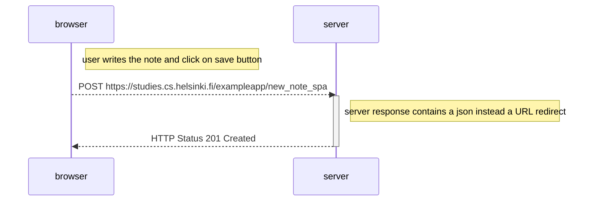

# FullStackOpen

## Exercise 0.6 - Answer

## 1. Writing the note and posting

```mermaid

sequenceDiagram
    participant browser
    participant server

    Note right of browser: user writes the note and click on save button

    browser-->>server: POST https://studies.cs.helsinki.fi/exampleapp/new_note_spa
    activate server
    note right of server: server response contains a json instead a URL redirect
    server-->>browser: HTTP Status 201 Created
    deactivate server

```